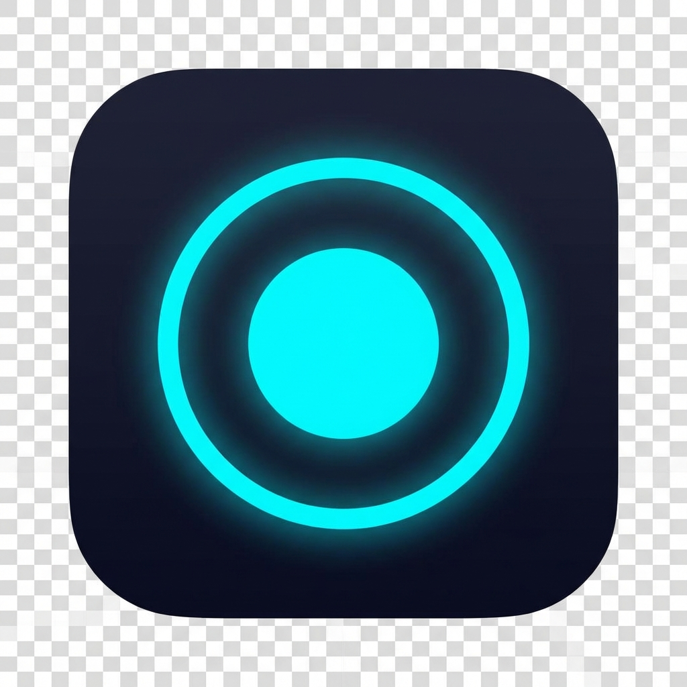

# NeoRecorder

[](https://github.com/DimSimd2020/NeoRecorder/actions/workflows/build.yml)
[](LICENSE)
[](https://python.org)
[](https://microsoft.com)

🎬 Высокопроизводительное приложение для записи экрана с поддержкой до 240 FPS и аппаратным ускорением.



> [!NOTE]
> **Это автономное десктопное приложение**, а не библиотека или API.  
> NeoRecorder не предназначен для использования как модуль в других проектах.  
> Для записи экрана из кода рекомендуется использовать FFmpeg напрямую.

## ✨ Возможности

- **Высокая производительность** — запись до 240 FPS с аппаратным ускорением (NVIDIA NVENC, Intel QuickSync, AMD AMF)
- **Гибкая область захвата** — полный экран, выбранная область или конкретное окно
- **Захват аудио** — микрофон и системные звуки
- **Надёжная пауза** — сегментная запись без артефактов
- **Real-time мониторинг** — FPS, bitrate, dropped frames в реальном времени
- **Современный интерфейс** — киберпанк дизайн на CustomTkinter
- **Уведомления Windows** — информирование о завершении записи

### 🆕 v1.4.0
- **Фоновый режим** — сворачивание в системный трей
- **Quick Capture** — быстрый скриншот/запись области по `Ctrl+Shift+S`
- **Горячие клавиши** — глобальные настраиваемые комбинации
- **Скриншоты** — мгновенный захват области в PNG

## 🚀 Установка

### Готовый установщик (рекомендуется)
Скачайте последний релиз из [Releases](https://github.com/DimSimd2020/NeoRecorder/releases) и запустите `NeoRecorder_Setup.exe`.

FFmpeg включён в установщик — дополнительная установка не требуется.

### Из исходного кода
```bash
# Клонирование
git clone https://github.com/DimSimd2020/NeoRecorder.git
cd NeoRecorder

# Установка зависимостей
pip install -r requirements.txt

# Скачайте ffmpeg.exe и поместите в корень проекта
# https://ffmpeg.org/download.html

# Запуск
python main.py
```

## 🔧 Требования

- Windows 10 (20H1 или новее) / Windows 11
- Python 3.9+ (для разработки)
- Видеокарта с поддержкой аппаратного кодирования (опционально, но рекомендуется)

### О FFmpeg

> [!IMPORTANT]
> **Релизная версия (установщик):**  
> FFmpeg автоматически устанавливается вместе с приложением.
>
> **Разработка из исходного кода:**  
> `ffmpeg.exe` **не включён в репозиторий** из-за ограничений GitHub (207 МБ).  
> Скачайте: https://github.com/BtbN/FFmpeg-Builds/releases  
> Поместите `ffmpeg.exe` в корень проекта.

## 📦 Сборка

### EXE файл
```bash
python build.py
```

### Установщик (требуется [Inno Setup](https://jrsoftware.org/isinfo.php))
```bash
iscc setup_script.iss
```

## 🎯 Использование

1. Запустите NeoRecorder
2. Выберите режим записи: **Экран** / **Область** / **Окно**
3. Настройте аудио источники (микрофон, системный звук)
4. Откройте ⚙️ настройки для выбора FPS и качества
5. Нажмите кнопку записи
6. Используйте плавающий виджет для паузы/остановки

## ⚙️ Настройки

| Параметр | Значения | Описание |
|----------|----------|----------|
| FPS | 30, 60, 120, 144, 240 | Частота кадров записи |
| Качество | Быстрая, Баланс, Качество, Без потерь | Профиль кодирования |
| Кодек | Auto | Автоопределение (NVENC → QSV → AMF → x264) |
| Путь | Настраиваемый | Папка для сохранения записей |

## 📁 Структура проекта

```
NeoRecorder/
├── main.py                  # Точка входа
├── config.py                # Конфигурация приложения
├── build.py                 # Скрипт сборки PyInstaller
├── setup_script.iss         # Inno Setup скрипт
├── requirements.txt         # Python зависимости
│
├── core/
│   ├── recorder.py          # Управление записью
│   ├── audio_manager.py     # Аудио устройства и VU-метр
│   └── window_finder.py     # Поиск активных окон
│
├── gui/
│   ├── app.py               # Главное окно приложения
│   ├── widgets.py           # Кастомные виджеты (VUMeter)
│   ├── overlay.py           # Overlay выбора области
│   └── recording_widget.py  # Плавающий виджет записи
│
├── utils/
│   ├── ffmpeg_handler.py    # FFmpeg процесс и парсинг
│   ├── notifications.py     # Windows Toast уведомления
│   └── logger.py            # Логирование
│
└── assets/
    ├── icons/               # UI иконки
    └── lang/                # Локализации (ru, en)
```

## 🛠️ Разработка

### Требования для разработчиков
```bash
pip install -r requirements.txt
pip install pytest flake8  # опционально, для тестов и линтинга
```

### Запуск тестов
```bash
pytest tests/
```


## 📄 Лицензия

Apache License 2.0 — см. [LICENSE](LICENSE)

## 👤 Автор

**DimSimd** — https://github.com/DimSimd2020

---

<p align="center">
  <b>NeoRecorder</b> — Record your screen like a pro 🎬
</p>
